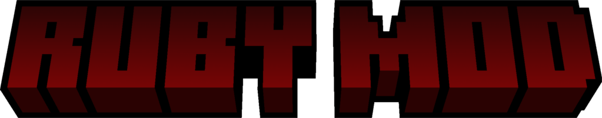

## This is the source code of the Ruby Mod made by me, Gregor Valusso (NJ_ROSSO on minecraft).

This mod is under development. This means it is going to be updated and maybe one day it will end being on curseforge, but at the moment no. The mod will not be updated to every minecraft version.

## Capolavoro

Il ramo 1.16.5 di questa mod è stato utilizzato come capolavoro della piattaforma unica dell'anno 2023/2024 

## Credits

-The mod logo has been created using "Minecraft Title" plugin of blockbench.

-All the resource of the mod have been made using Blockbench

## Thanks

Special thanks to KaupenJoe for his modding tutorial series, to the Blockbench developers, to LukeGraham with his site moddingtutorials.org and to the minecraft modding community
